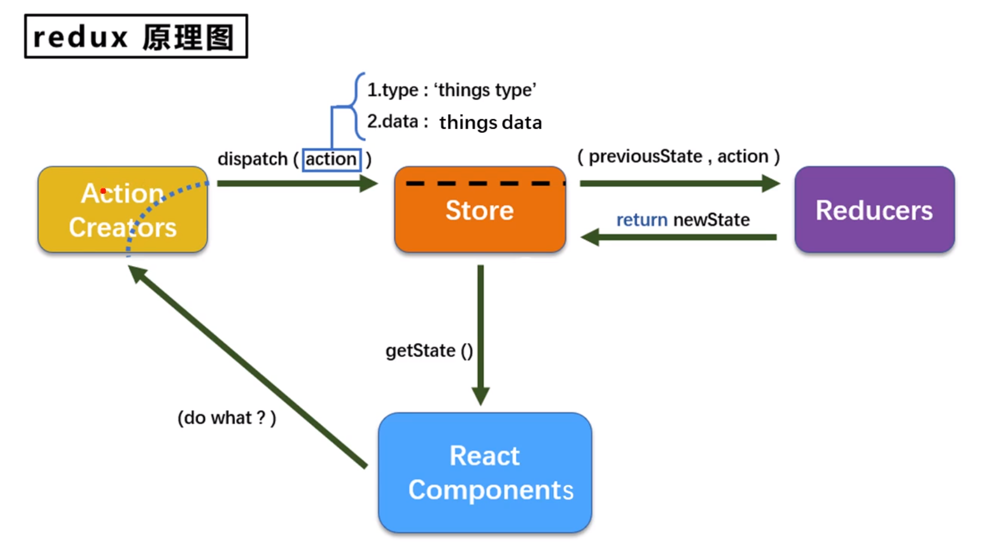
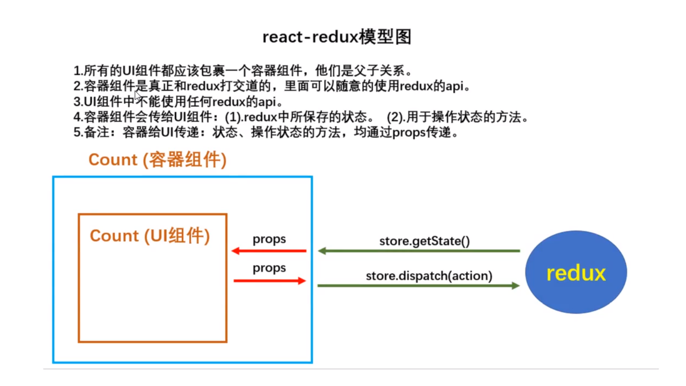

[Back to Master](/#demo14)

知识点



1. react-redux的基本使用
2. 容器组件和UI组件
3. 使用connect方法创建容器组件
   ```javascript
   /*connect函数的参数，映射redux中的状态到UI组件的props*/
    function mapStateToProps(state) {
    /*count可以在CountUI组件的props中找到*/
    return {count: state}
    }

    /*connect函数的参数，映射redux中的dispatch方法到UI组件的props*/
    function mapDispatchToProps(dispatch) {
    /*increase，decrease，increaseAsync可以在CountUI组件的props中找到*/
        return {
            increase: (data) => {
                dispatch(createIncrementAction(data))
            },
            decrease: (data) => dispatch(createDecrementAction(data)),
            increaseAsync: (data, waitTime) => dispatch(createIncrementAsyncAction(data, waitTime))
         }
    }

    /*使用connect函数连接UI组件和redux，并返回一个容器<组件>*/ // export default connect(mapStateToProps, mapDispatchToProps)(CountUI)

    // 或者简写 
    export default connect(
      (state) => ({count: state}), 
    /*这里mapDispatchToProps省略了dispatch的步骤，由react-redux内部自动dispatch*/
    { 
           increase: createIncrementAction, 
           decrease: createDecrementAction, 
           increaseAsync: createIncrementAsyncAction
    })(CountUI)

   ```

4. Provider组件管理可以管理redux store
5. react-redux可以自动管理store.subscribe，所以不用自己写监测