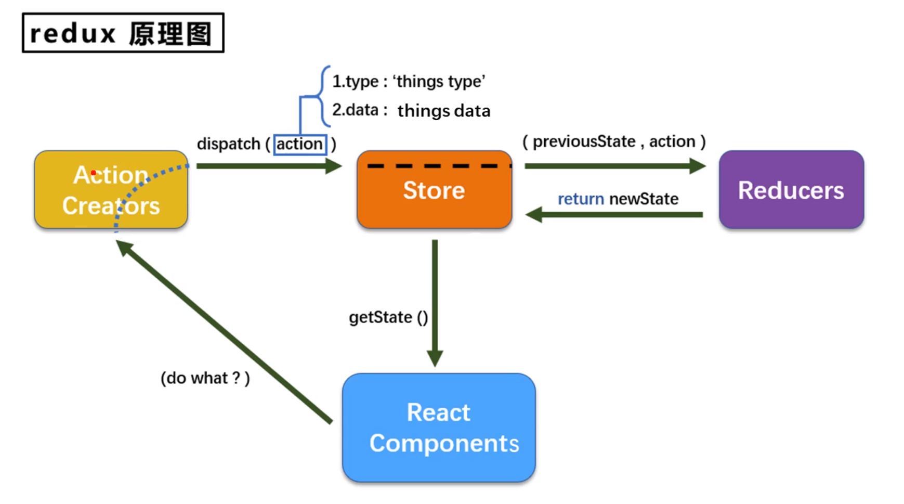

[Back to Master](/#demo15)

知识点



```text
src
├── App.js
├── containers
│   ├── Count
│   │   └── index.jsx
│   └── Person
│       └── index.jsx
├── index.css
├── index.js
├── README.md
└── redux
    ├── actions
    │   ├── count.js
    │   └── person.js
    ├── constant.js
    ├── reducers
    │   ├── count.js
    │   ├── index.js
    │   └── person.js
    └── store.js

```

1. 多组件使用redux通信（通过connect的mapStateToProps参数）
2. redux保存复杂数据
3. combineReducer 组合不同种类的reducer
4. redux-devtools-extension
5. reducer是纯函数，不能更改直接更改prevState